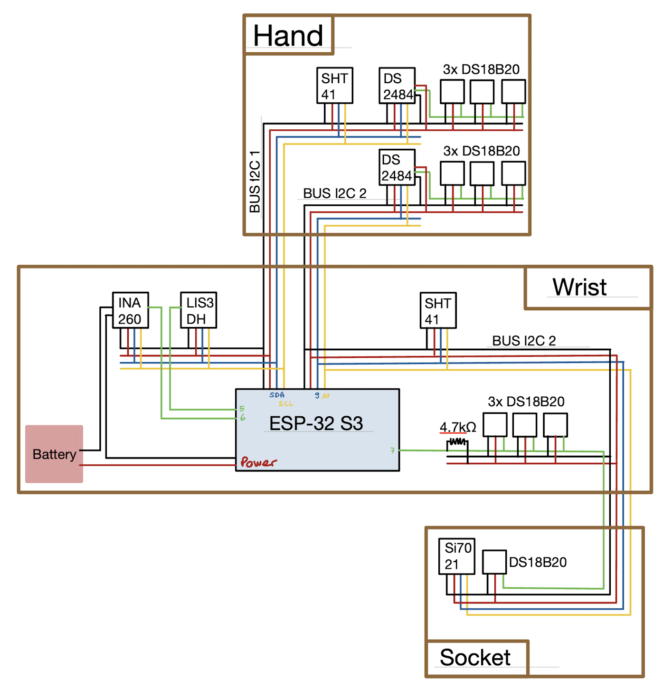
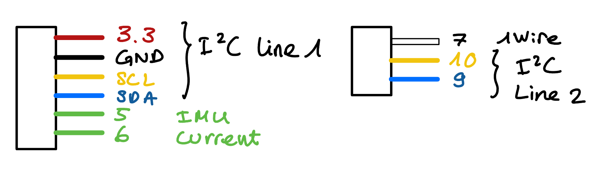
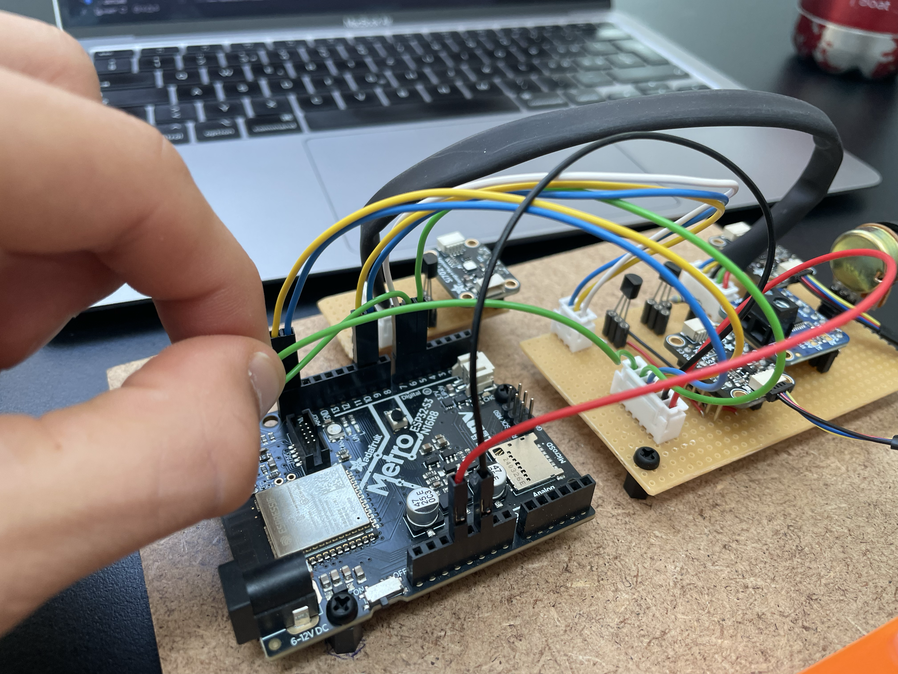
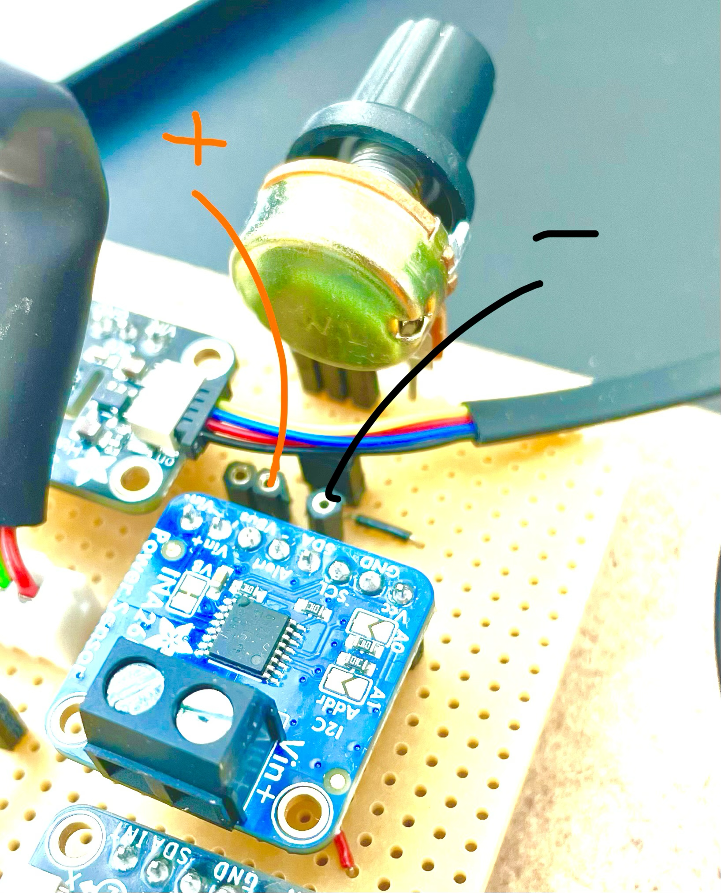
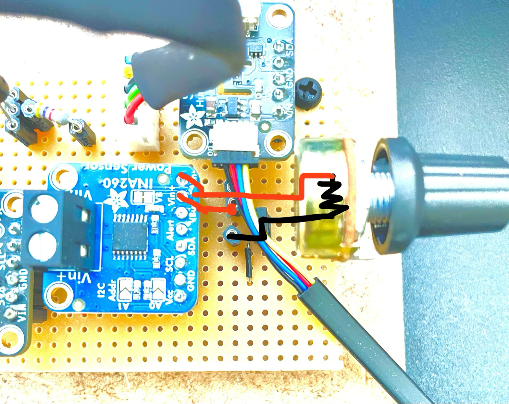
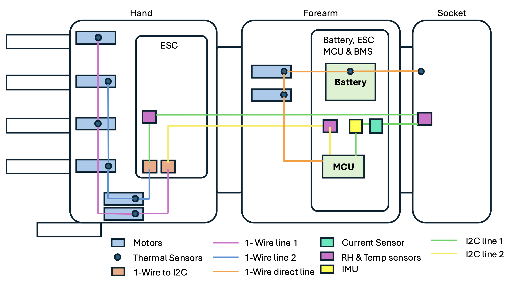

# N-Pulse Prosthetic Safety System

> **EPFL N-Pulse — Spring Semester 2026**  
> Firmware and GUI for the safety monitoring board of the N-Pulse transradial bionic arm prosthesis.  
> For background on sensor selection rationale, thresholds, and design decisions, refer to the accompanying report.

---

## Repository Structure

```
/
├── GUI/
│   └── serial_dashboard.py        # Plotly Dash web dashboard — reads serial CSV and plots live telemetry
│
└── prosthetic_safety/
    ├── prosthetic_safety.ino      # Arduino sketch entry point (setup + loop)
    ├── Config.h                   # ⬅ All pin assignments, I2C addresses, thresholds — edit here first
    ├── DataTypes.h / .cpp         # Structs (TH_Reading, PowerReading, IMUReading, SafetyFlags) and global sensor objects
    ├── Setup.h / .cpp             # Sensor initialisation and interrupt attachment
    ├── Sensors.h / .cpp           # Sensor read functions (non-blocking DS18B20, SHT41, Si7021, INA260, LIS3DH)
    ├── Safety.h / .cpp            # Fault evaluation logic + ISR handlers
    ├── Logging.h / .cpp           # CSV serial output and SD card stub
    └── Utils.h / .cpp             # Helpers: ROM printing, threshold lookups, raw IMU register I/O
```

---

## Hardware Connections

The system uses two I2C buses on the Adafruit Metro ESP32-S3. Bus 0 (`Wire`, default pins) and Bus 1 (`Wire1`, pins 9 SDA / 10 SCL) are both active simultaneously.

### Pin Map (from `Config.h`)

| Signal | ESP32-S3 Pin | Connected to |
|--------|-------------|--------------|
| SDA0 | Pin SDA | DS2484 bus0, INA260, LIS3DH, SHT41 bus0 |
| SCL0 | Pin SCL | Same as above |
| SDA1 | Pin 9 | DS2484 bus1, SHT41 bus1, Si7021 |
| SCL1 | Pin 10 | Same as above |
| 1-Wire direct | Pin 7 | Battery, socket, and 1 motor DS18B20 (no bridge chip) |
| IMU interrupt | Pin 5 | LIS3DH INT1 → MCU (active-low, pull-up enabled) |
| Current alert | Pin 6 | INA260 ALERT → MCU (active-low, pull-up enabled, latching) |
| Power cut | Pin 11 | Pololu switch CTRL — pull **LOW** to cut load power |


### Wiring Diagram



#### JST cable labels





#### Current interupt test-bench wiring





Depending on the setup, it may be beneficial to make sure VIN- is the same as the systems GND (e.g. when using a lab alim), then wire like on the image (with the jumper). When trying to use the sensor on the test bench with the battery for example, simple pass the high or low cable of the battery through the VIN+ to VIN-. You might want remove the jumper and potentiometer to avoid any confusion in the wiring (unless the grounding is still useful). 

#### System-level block diagram and hand-level schematic: 


### I2C Address Map

| Device | Bus | Address | Notes |
|--------|-----|---------|-------|
| DS2484 (×2) | 0 and 1 | `0x18` | Fixed — one per bus to avoid collision |
| LIS3DH | 0 | `0x19` | SDO tied HIGH |
| INA260 | 0 | `0x40` | A0/A1 default |
| SHT41 (×2) | 0 and 1 | `0x44` | Fixed — one per bus to avoid collision |
| Si7021 | 1 | `0x40` | Shares bus 1 with SHT41, different from INA260 on bus 0 |

### DS18B20 Temperature Sensor Topology

Nine DS18B20s are distributed across three 1-Wire lines:

- **Bus 0 (via DS2484 on I2C bus 0):** 3 motor sensors in the hand
- **Bus 1 (via DS2484 on I2C bus 1):** 3 motor sensors in the hand
- **Direct line (pin 7, no bridge):** battery sensor, socket/stump contact sensor, 1 motor sensor

Each DS18B20 line needs a **4.7 kΩ pull-up resistor between DQ and 3.3 V** (but the ones passed in I2C already have a sufficient pullup resistance through the DS2484). The direct line uses the `DallasTemperature` library at **9-bit resolution** (94 ms conversion time, 0.5 °C) for faster updates. The DS2484-bridged lines use the `Adafruit_DS248x` library and the same 94 ms window.

### Power Cut Circuit

```
Battery (+) ──► Power Switch VIN ──► Prosthetic rail (+)
Battery (−) ──► Power Switch GND            ──► Prosthetic rail (−)
                        │
               ESP32-S3 Pin 11 ──► CTRL (LOW = power cut)
```

`PIN_POWER_CUT` is driven LOW by either the main loop (`requestPowerCut()`) or directly from the ISR for minimum latency on overcurrent and shock events.

---

## Sensor Discovery & Address Registration

**When new DS18B20 sensors are installed, their ROM addresses must be registered in `Config.h`.** (This should be already correct if the test-bench wasn't changed.) The firmware will print every discovered ROM to the serial monitor at startup — run the sketch once, note the ROM codes, then fill in the `bus0_sensors[]`, `bus1_sensors[]`, and `direct_sensors[]` arrays with the appropriate `SensorPurpose` and per-sensor temperature limit.

```cpp
// Example entry in Config.h
static constexpr SensorMapping direct_sensors[] = {
  {{ 0x28, 0xFF, 0x64, 0x0E, 0x6D, 0x54, 0x36, 0xC9 }, SensorPurpose::BATTERY, 45.0f },
  {{ 0x28, 0xFF, 0x64, 0x0E, 0x6D, 0x86, 0x2C, 0xE3 }, SensorPurpose::SOCKET,  41.0f },
  ...
};
```

Per-sensor limits (battery: 45 °C, socket contact: 41 °C, motors: 85 °C) are looked up at runtime by ROM address in `getSensorTempLimit()` (`Utils.cpp`). If a sensor's ROM is not in the table, it falls back to `MAX_TEMP_C`.

---

## INA260 Current Sensor — Bench Test

The INA260 sits in **series** with the battery. Before installing in the arm, validate it on a bench:

### Wiring for the test

```
Bench PSU (+) ──► INA260 IN+ ──► INA260 IN− ──► Load ──► Bench PSU (−)
                     │
              I2C to ESP32-S3 (bus 0, address 0x40)
              ALERT pin → ESP32-S3 pin 6
```

> ⚠️ The INA260 has **no galvanic isolation** between the battery ground and the board ground. Make sure both share the same ground reference, or use an isolated bench PSU. (That is the case on the test-bench)

### Recommended bench settings

| Parameter | Value |
|-----------|-------|
| PSU voltage | **12 V** |
| PSU current limit | **100 mA** |


The alert pin is configured in hardware for **overcurrent** (fires when current exceeds `Config::MAX_CURRENT_MA`). During bench testing, `MAX_CURRENT_MA` is set to 40 mA so the alert fires well within the PSU limit — set it back to 5300 mA (or appropriate value) for normal prosthetic operation.

---

## Arduino Libraries Required

Install all of the following via the Arduino Library Manager before compiling:

| Library | Used for |
|---------|---------|
| `Adafruit_INA260` | Current/voltage sensor |
| `Adafruit_LIS3DH` + `Adafruit_Sensor` | IMU |
| `Adafruit_Si7021` | Humidity/temp sensor (socket) |
| `7semi_SHT4x` | Humidity/temp sensors (hand/wrist) |
| `Adafruit_DS248x` | I2C-to-1-Wire bridge (DS2484) |
| `DallasTemperature` | Direct 1-Wire DS18B20 (no bridge) |
| `OneWire` | Required by DallasTemperature |

**Board:** Adafruit Metro ESP32-S3 (install via Arduino Boards Manager → search "esp32" by Espressif).

---

## Uploading the Firmware

1. Open `prosthetic_safety/prosthetic_safety.ino` in Arduino IDE.
2. Select **Board → Adafruit Metro ESP32-S3** and the correct COM/tty port.
3. Upload. On first boot, watch the serial monitor at **115 200 baud** — setup messages are prefixed with `[SETUP]`. Any sensor not found will print a warning; the ROM addresses of all discovered DS18B20s are printed here for registration.

---

## GUI — Live Telemetry Dashboard

`GUI/serial_dashboard.py` is a Plotly Dash web app. It reads the CSV stream from the serial port and displays five real-time subplots plus status LEDs for each safety flag.

### Install dependencies

```bash
pip install pyserial dash plotly pandas
```

### Configure the port

Edit the top of `serial_dashboard.py`:

```python
SERIAL_PORT   = '/dev/cu.usbmodem101'   
BAUD_RATE     = 115200
```
Replace with the correct port address. 

### Run

```bash
python GUI/serial_dashboard.py
```

Then open **http://127.0.0.1:8050** in any browser. The dashboard auto-reconnects if the serial connection drops.

### What is displayed

| Panel | Channels |
|-------|---------|
| Motor Temperatures | bus0_ds1–3, bus1_ds1–3, direct_ds1, socket contact, battery |
| Body Temperatures | Hand, wrist, socket ambient (SHT41 + Si7021) |
| Relative Humidity | Hand, wrist, socket (SHT41 + Si7021) |
| IMU Data | ax, ay, az [g] + vector magnitude |
| Power Data | Current [mA], voltage [V], power [mW] |
| Status LEDs | Temp limit, humidity limit, overcurrent, shock, power cut, sensors OK |

At startup the dashboard performs a one-time health check: any channel that reads `nan`, 0.0 (humidity), or below −10 °C (temperature) is automatically deselected. You can re-enable channels manually using the checklist below the plots.

### CSV format

The firmware emits one comma-separated line every 500 ms (configurable via `Config::LOG_PERIOD_MS`). Lines starting with `#` are ignored by the dashboard. The exact column order is:

```
t_ms, hand_temp_c, hand_rh, wrist_temp_c, wrist_rh, socket_temp_c, socket_rh,
bus0_ds1_c, bus0_ds2_c, bus0_ds3_c, bus1_ds1_c, bus1_ds2_c, bus1_ds3_c,
battery, socket, direct_ds1_c,
imu_ax_g, imu_ay_g, imu_az_g, imu_mag_g,
current_ma, bus_mv, power_mw,
temp_limit_flag, humidity_limit_flag, overcurrent_limit_flag,
shock_flag, power_cut_flag, sensors_ok
```

---

## Enabling Power Cut Actions

All four power-cut triggers are **disabled by default** in `Config.h` for safe development:

```cpp
static const bool ENABLE_POWER_CUT_ON_OVERCURRENT        = false;
static const bool ENABLE_POWER_CUT_ON_OVERHEAT           = false;
static const bool ENABLE_POWER_CUT_ON_OVERHUMIDITY       = false;
static const bool ENABLE_POWER_CUT_ON_CONFIRMED_SHOCK    = false;
```

Set the relevant flag(s) to `true` once you have validated each sensor path end-to-end. The overcurrent and shock paths trigger from the ISR (minimum latency); overheat and humidity are evaluated in the main loop every `LOG_PERIOD_MS`.

Once a power cut is triggered, it **latches** — the flag does not reset automatically. A manual reset (power cycle or serial command) is required before the safety system will re-arm.

---

## Troubleshooting

If one of the lines is not being detected, it often happens that the pins are not well plugged in on the MCU (the pins tend to slip out). 

The code defaults with `PRINT_CSV_HEADER_AT_BOOT = false`. To have the CSV header printed at startup for easier csv reading, simple set that to `true`. 

## What to Add Next

- **SD card logging** — `logToSDCard()` in `Logging.cpp` is empty. The Metro ESP32-S3 has a built-in MicroSD slot and it would be a useful feature for the safety system. 
- **Using MCU Wireless capabilities** — The ESP32-S3 supports WiFi and Bluetooth; useful for reading data without cable connection with the arm.
- **CAN / UART protocol** — Define how fault codes are forwarded to the main prosthetic control board.

---

## Contributors

| Name | Role | Semester |
|------|------|----------|
| Mathis Finckh | Safety System Design & Implementation | Spring 2026 |

*Please update this table when you pick up the project.*
